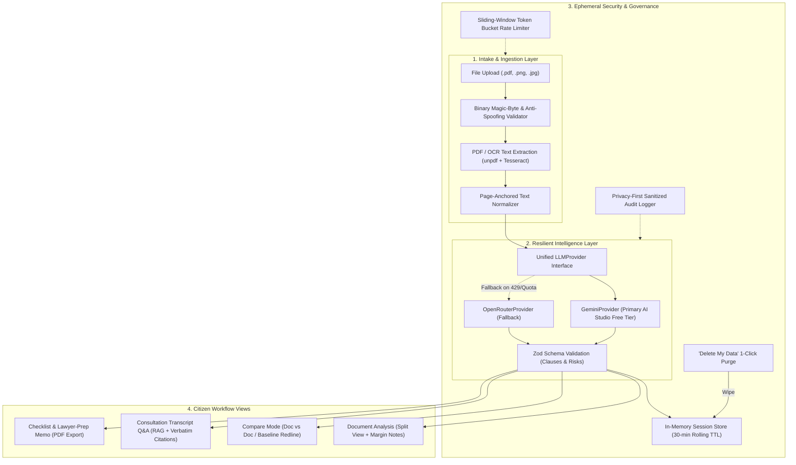

# NyaySetu (न्यायसेतु) — Grounded Legal Access & Assistance

> **Google Prompt Wars — "AI for Legal Assistance & Access"**  
> Demystifying complex legal agreements for tenants, gig workers, and small traders with grounded, accessible intelligence.

---

## 1. Problem-Statement Coverage

Per **01-PRD.md**, the table below maps every required use case from the hackathon brief to the shipped features in NyaySetu:

| Brief's Use Case                                              | Feature in NyaySetu                                                            | Implementation Module                                                                                          |
| ------------------------------------------------------------- | ------------------------------------------------------------------------------ | -------------------------------------------------------------------------------------------------------------- |
| **Simplifying complex legal documents**                       | Plain-language mode, adjustable reading level (Plain vs. Detailed toggle)      | [`features/document-analysis/`](file:///c:/Users/sreej/Downloads/Projects/NyaySetu/features/document-analysis) |
| **Comparing contracts, agreements, policies**                 | Compare mode (Document-vs-Document, or Document-vs-Fair-Baseline redline)      | [`features/compare/`](file:///c:/Users/sreej/Downloads/Projects/NyaySetu/features/compare)                     |
| **Highlighting clauses, obligations, risks, inconsistencies** | Risk & clause scoring with non-color accessible indicators and margin notes    | [`features/extraction/`](file:///c:/Users/sreej/Downloads/Projects/NyaySetu/features/extraction)               |
| **Answering questions based on provided documents**           | Grounded consultation Q&A, strictly scoped to document with verbatim citations | [`features/qa-chat/`](file:///c:/Users/sreej/Downloads/Projects/NyaySetu/features/qa-chat)                     |
| **Understanding options and next steps**                      | Action item checklist generation from high-risk clauses                        | [`features/checklist-export/`](file:///c:/Users/sreej/Downloads/Projects/NyaySetu/features/checklist-export)   |
| **Generating summaries, checklists, actionable outputs**      | Executive memo summary + PDF checklist export                                  | [`features/checklist-export/`](file:///c:/Users/sreej/Downloads/Projects/NyaySetu/features/checklist-export)   |
| **Preparing questions for a legal professional**              | "Questions for your lawyer" one-pager with bordered memo styling               | [`features/checklist-export/`](file:///c:/Users/sreej/Downloads/Projects/NyaySetu/features/checklist-export)   |

---

## 2. Services Utilized (Written Submission Section)

In accordance with **00-MASTER.md** and the hackathon written submission requirements, the following table details every external API, service, and infrastructure target utilized across NyaySetu, along with its specific role and location in the codebase:

| Service / API                 | Specific Model / Library                           | Where Used in the Product                                                                                                                                                                                                                                                           | Codebase Location                                                                                                                                                                                                                                                                                                                                                                                                                          |
| ----------------------------- | -------------------------------------------------- | ----------------------------------------------------------------------------------------------------------------------------------------------------------------------------------------------------------------------------------------------------------------------------------- | ------------------------------------------------------------------------------------------------------------------------------------------------------------------------------------------------------------------------------------------------------------------------------------------------------------------------------------------------------------------------------------------------------------------------------------------ |
| **Google Gemini API**         | `gemini-1.5-flash` (Google AI Studio Free Tier)    | **Primary LLM Engine:** Performs single-pass structured extraction of legal clauses, risk levels (`info`/`caution`/`high-risk`), plain-language summaries, grounded Q&A with citation verification, redline delta comparisons, and lawyer consultation checklists.                  | [`lib/llm/gemini-provider.ts`](file:///c:/Users/sreej/Downloads/Projects/NyaySetu/lib/llm/gemini-provider.ts)<br>[`app/api/extract/route.ts`](file:///c:/Users/sreej/Downloads/Projects/NyaySetu/app/api/extract/route.ts)<br>[`app/api/qa/route.ts`](file:///c:/Users/sreej/Downloads/Projects/NyaySetu/app/api/qa/route.ts)<br>[`app/api/compare/route.ts`](file:///c:/Users/sreej/Downloads/Projects/NyaySetu/app/api/compare/route.ts) |
| **OpenRouter API**            | `google/gemini-flash-1.5` (Fallback Provider)      | **Resilient LLM Fallback:** Sits behind the unified `LLMProvider` interface. If Gemini encounters rate limits (HTTP 429), quota exhaustion, or server errors, the system automatically falls back to OpenRouter, logging provider provenance without failing the citizen's request. | [`lib/llm/openrouter-provider.ts`](file:///c:/Users/sreej/Downloads/Projects/NyaySetu/lib/llm/openrouter-provider.ts)<br>[`lib/llm/fallback-provider.ts`](file:///c:/Users/sreej/Downloads/Projects/NyaySetu/lib/llm/fallback-provider.ts)                                                                                                                                                                                                 |
| **OCR & Text Extraction**     | `unpdf` (Native PDF) + `tesseract.js` (Visual OCR) | **Document Intake Engine:** Extracts text layers from native PDF contracts or executes optical character recognition on scanned/photographed agreements (JPG/PNG). Normalizes raw text into page-anchored text models.                                                              | [`features/ingestion/services/extractor.ts`](file:///c:/Users/sreej/Downloads/Projects/NyaySetu/features/ingestion/services/extractor.ts)<br>[`features/ingestion/services/normalizer.ts`](file:///c:/Users/sreej/Downloads/Projects/NyaySetu/features/ingestion/services/normalizer.ts)<br>[`app/api/ingest/route.ts`](file:///c:/Users/sreej/Downloads/Projects/NyaySetu/app/api/ingest/route.ts)                                        |
| **Web Speech API**            | Native Browser Speech Recognition & Synthesis      | **Multimodal Accessibility:** Powers hands-free voice dictation for legal questions and text-to-speech audio reading of plain-language summaries for low-literacy or visually impaired citizens. Zero server latency and 100% client-side privacy.                                  | [`features/accessibility/hooks/use-speech.ts`](file:///c:/Users/sreej/Downloads/Projects/NyaySetu/features/accessibility/hooks/use-speech.ts)                                                                                                                                                                                                                                                                                              |
| **Hosting & Edge Deployment** | Vercel (Next.js App Router & Edge Middleware)      | **Production Deployment Target:** Hosts the Next.js serverless application, Edge Middleware for HTTPS enforcement and session cookie provisioning, global CDN asset delivery, and API route execution.                                                                              | [`middleware.ts`](file:///c:/Users/sreej/Downloads/Projects/NyaySetu/middleware.ts)<br>[`next.config.mjs`](file:///c:/Users/sreej/Downloads/Projects/NyaySetu/next.config.mjs)                                                                                                                                                                                                                                                             |

---

## 3. Architecture Overview

NyaySetu is engineered around five core design tenets:

1. **Provider-Agnostic LLM Resilience:** The application never invokes provider SDKs directly. A unified `LLMProvider` interface abstracts all language model calls. `FallbackLLMProvider` wraps `GeminiProvider` (primary) and `OpenRouterProvider` (secondary), automatically catching quota or rate-limit errors and recording provider provenance metadata for each transaction.
2. **Ephemeral & Privacy-First by Design:** No user accounts, multi-tenant databases, or persistent vector stores. In-memory session store ([`InMemorySessionStore`](file:///c:/Users/sreej/Downloads/Projects/NyaySetu/lib/security/session-store.ts)) isolates case data with a rolling 30-minute TTL and automatic garbage collection. A 1-click **"Delete My Data"** control completely purges server memory and browser storage.
3. **Zero Document Content in Logs:** The [`securityLogger`](file:///c:/Users/sreej/Downloads/Projects/NyaySetu/lib/security/logger.ts) sanitizes all operational logging, recursively redacting contract text, excerpts, citizen questions, prompts, and tokens to `[REDACTED_FOR_PRIVACY]` while preserving non-sensitive operational metrics (`docId`, `pageCount`, `latencyMs`).
4. **Accessible, Trust-Building Design System:** Custom parchment-and-ink visual language inspired by official legal registers (`#F7F3EA` background, `#1B2430` deep navy text, `#B08D57` legal brass accents). Built using Radix UI primitives and Tailwind CSS with strict WCAG 2.1 AA contrast compliance, non-color visual indicators for risk levels, screen-reader live regions, and regional language support (English, Hindi, Tamil).
5. **Efficiency & Single GSAP Flagship Moment:** GSAP animation is strictly isolated to the document intake desk (the tactile paper settling and scan-line effect). All other UI transitions use lightweight Framer Motion variants, ensuring optimal runtime performance and low-bandwidth resilience.



---

## 4. Setup & Local Development Instructions

### Prerequisites

- **Node.js**: `v20.x` or later (LTS recommended)
- **npm**: `v10.x` or later
- **Git**: Installed and configured

### 1. Clone the Repository

```bash
git clone https://github.com/your-username/nyaysetu.git
cd nyaysetu
```

### 2. Install Dependencies

```bash
npm install
```

### 3. Configure Environment Variables

Copy the committed environment template:

```bash
cp .env.example .env.local
```

Open `.env.local` and add your API keys:

```env
# Primary LLM: Google Gemini API (AI Studio free tier: gemini-1.5-flash)
# https://aistudio.google.com/app/apikey
GEMINI_API_KEY=your_gemini_api_key_here

# Fallback LLM: OpenRouter API (google/gemini-flash-1.5)
# https://openrouter.ai/keys
OPENROUTER_API_KEY=your_openrouter_api_key_here

# Security Settings
NODE_ENV=development
SESSION_TTL_MINUTES=30
MAX_UPLOAD_SIZE_MB=10
```

> **Note**: Even if API keys are omitted in development, NyaySetu contains pre-configured realistic mock fallbacks for testing intake, redline comparison, grounded Q&A, and checklist export without incurring API usage.

### 4. Run the Development Server

```bash
npm run dev
```

Open [http://localhost:3000](http://localhost:3000) in your browser to view the application.

---

## 5. Verification & Testing

NyaySetu enforces strict continuous verification across tests, types, linting, formatting, and build integrity:

```bash
# 1. Run all 66 Vitest unit and integration tests
npm test

# 2. Run TypeScript static type checking
npm run typecheck

# 3. Run ESLint with accessibility rules (eslint-plugin-jsx-a11y)
npm run lint

# 4. Check code formatting with Prettier
npm run format:check

# 5. Execute production build with Next.js & Edge Middleware
npm run build
```

---

## 6. Project Structure

```
NyaySetu/
├── app/                              # Next.js App Router (pages & API routes)
│   ├── api/
│   │   ├── compare/route.ts          # Contract comparison & redline analysis endpoint
│   │   ├── extract/route.ts          # Structured clause & risk extraction endpoint
│   │   ├── ingest/route.ts           # Document upload & OCR endpoint
│   │   ├── qa/route.ts               # Grounded Q&A consultation endpoint
│   │   └── session/route.ts          # Session health check & 'Delete My Data' purge
│   ├── globals.css                   # Global CSS & accessibility tokens
│   ├── layout.tsx                    # Root layout with parchment theme
│   └── page.tsx                      # Main unified workspace view
├── features/                         # Feature-driven domain modules
│   ├── accessibility/                # i18n (en/hi/ta), voice dictation/TTS, low-bandwidth mode
│   ├── checklist-export/             # Lawyer prep memo, action items, client-side PDF export
│   ├── compare/                      # Redline comparison view (doc-vs-doc, doc-vs-baseline)
│   ├── document-analysis/            # Split-screen viewer & margin notes column
│   ├── extraction/                   # Structured clause parsing, risk tagging, reading level toggle
│   ├── ingestion/                    # Ingestion desk, unpdf extraction, Tesseract OCR, flagship GSAP
│   ├── qa-chat/                      # Formal consultation transcript Q&A, RAG citation chips
│   └── security/                     # 'Delete My Data' confirmation dialog & wipe controls
├── lib/                              # Core shared libraries
│   ├── llm/                          # Unified LLM provider interface, Gemini & OpenRouter adapters
│   └── security/                     # Session store, rate limiter, zero-leak logger, magic-byte validator
├── tests/                            # Automated test suite (66 tests in 8 files)
│   ├── accessibility.test.tsx        # axe-core WCAG 2.1 AA audit, keyboard nav, speech
│   ├── checklist.test.ts             # Lawyer questions and action checklist generator
│   ├── compare.test.ts               # Redline diffing & advantage tagging
│   ├── extraction.test.ts            # Clause schema validation & LLM resilience fallback
│   ├── normalizer.test.ts            # Text normalization & page anchoring
│   ├── qa.test.ts                    # Grounded RAG Q&A & out-of-scope refusal
│   ├── security.test.ts              # Magic bytes, rate limiting, TTL purge, zero-leak logging
│   └── tokens.test.ts                # Theme token contrast and design invariants
├── middleware.ts                     # Edge middleware for HTTPS enforcement & session cookies
├── next.config.mjs                   # Enterprise HTTP security headers (HSTS, CSP, X-Frame-Options)
├── tokens.ts                         # Central design system tokens (colors, typography, spacing)
├── motion-variants.ts                # Centralized Framer Motion variants
└── .env.example                      # Committed template for secrets documentation
```

---

## 7. Submission Checklist & Status

- [x] **F1 Ingestion:** PDF/Image upload, binary magic bytes, Tesseract OCR, normalized text, flagship GSAP animation.
- [x] **F2 Extraction:** Unified `LLMProvider` interface, Gemini primary + OpenRouter fallback, zod validation, risk scoring.
- [x] **F3 Document Analysis:** Split view, margin notes risk tags, plain-language vs. detailed toggle.
- [x] **F4 Compare Mode:** Doc-vs-doc and doc-vs-baseline comparison with redline diffs and user-advantage tagging.
- [x] **F5 Grounded Q&A:** Formal consultation register ("You asked" / "The document says"), verbatim citation chips, strict out-of-scope refusal.
- [x] **F6 Checklist & Export:** High-risk lawyer prep items, action checklist, letterhead-styled memo, PDF export.
- [x] **Accessibility (WCAG 2.1 AA):** Passed axe-core automated audits, keyboard navigation, prefers-reduced-motion, Web Speech API voice I/O, Hindi & Tamil language toggles, low-bandwidth mode.
- [x] **Security:** Ephemeral in-memory session store (30-min TTL), "Delete My Data" 1-click purge, zero document text in logs, HTTPS enforcement, sliding-window rate limiting, committed `.env.example`, zero high/critical npm vulnerabilities.
- [x] **CI Validation:** 100% green test suite (66/66 tests passing), 0 lint errors, 0 type errors, production build verified.
