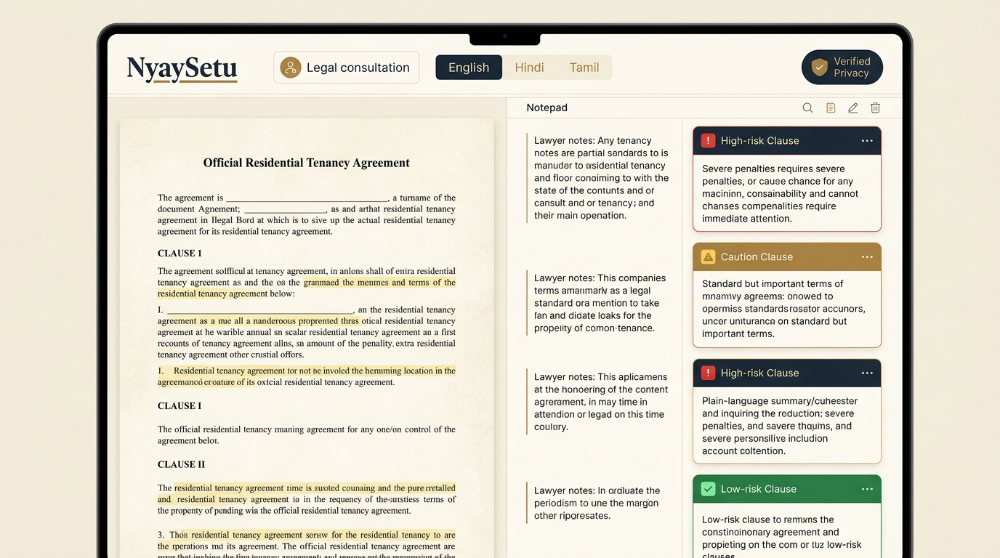
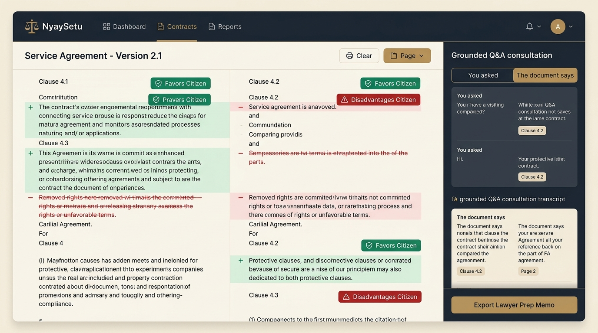
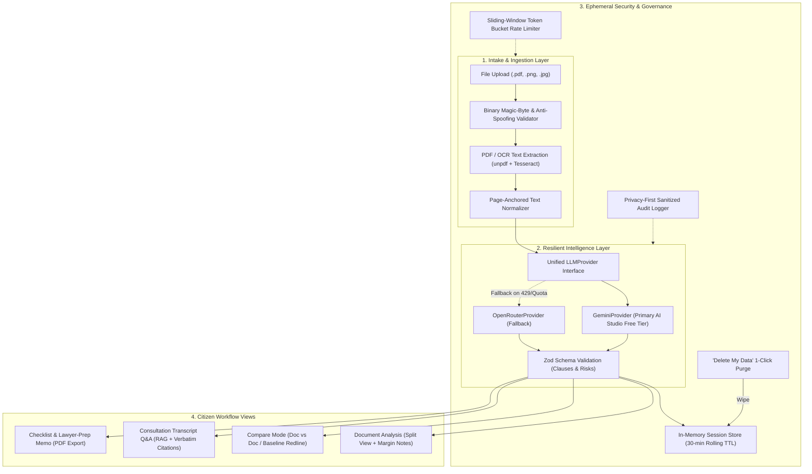

# NyaySetu (न्यायसेतु) — Grounded Legal Access & Assistance

> **Google Prompt Wars — "AI for Legal Assistance & Access"**  
> Demystifying complex legal agreements for tenants, gig workers, and small traders with grounded, accessible intelligence.

**Live demo:** https://nyay-setu-zeta.vercel.app/ · **No sign-up. Upload a contract (or tap "Try sample lease") — intake and memo work without API keys; LLM features degrade gracefully.**

> **Scope note:** NyaySetu provides information and lawyer-prep assistance — it does not replace professional legal advice. Every AI output is grounded in the uploaded document and paired with a "Questions for your lawyer" path.

<div align="center">


_Figure 1: Split-screen document analysis featuring page-anchored contract viewer, operative clause margin notes with accessible risk indicators, and multilingual controls._

<br/>


_Figure 2: Tracked-changes contract comparison mode with citizen advantage badges (`Favors You` / `Disadvantages You`) alongside grounded consultation Q&A with source clause citations._

</div>

---

### 1. Problem-Statement Coverage

The table below maps every required use case from the hackathon brief to the shipped features in NyaySetu:

| Brief's Use Case                                              | Feature in NyaySetu                                                                                    | Implementation Module                                         |
| ------------------------------------------------------------- | ------------------------------------------------------------------------------------------------------ | ------------------------------------------------------------- |
| **Simplifying complex legal documents**                       | Plain-language mode, adjustable reading level (Plain vs. Detailed toggle)                              | [`features/document-analysis/`](./features/document-analysis) |
| **Comparing contracts, agreements, policies**                 | Compare mode (Document-vs-Document, or Document-vs-Fair-Baseline redline)                              | [`features/compare/`](./features/compare)                     |
| **Highlighting clauses, obligations, risks, inconsistencies** | Risk & clause scoring with non-color accessible indicators and margin notes                            | [`features/extraction/`](./features/extraction)               |
| **Answering questions based on provided documents**           | Grounded consultation Q&A, strictly scoped to document with verbatim citations                         | [`features/qa-chat/`](./features/qa-chat)                     |
| **Understanding options and next steps**                      | Action item checklist generation from high-risk clauses                                                | [`features/checklist-export/`](./features/checklist-export)   |
| **Generating summaries, checklists, actionable outputs**      | Executive memo summary + PDF checklist export                                                          | [`features/checklist-export/`](./features/checklist-export)   |
| **Preparing questions for a legal professional**              | "Questions for your lawyer" one-pager with bordered memo styling                                       | [`features/checklist-export/`](./features/checklist-export)   |
| **Understanding options and next steps (beyond brief)**       | Deterministic Fairness Score (0–100 + band + drivers) calibrated on extraction and baseline comparison | [`features/fairness-score/`](./features/fairness-score)       |
| **Actionable outputs (beyond brief)**                         | Collaborative negotiation-email draft grounded in high-risk clauses, editable + streamed               | [`features/negotiation-email/`](./features/negotiation-email) |

> The brief encourages "entirely different use cases within the theme." Fairness Score and the negotiation-email draft are NyaySetu's two original extensions: the first turns clause risk into an at-a-glance negotiating position; the second turns it into the opening message — both derived strictly from the uploaded document, never freeform advice.

---

## 2. Services Utilized (Written Submission Section)

In accordance with the hackathon written submission requirements, the following table details every external API, service, and infrastructure target utilized across NyaySetu, along with its specific role and location in the codebase:

| Service / API                 | Specific Model / Library                           | Where Used in the Product                                                                                                                                                                                                                                                                    | Codebase Location                                                                                                                                                                                                                                                                                                      |
| ----------------------------- | -------------------------------------------------- | -------------------------------------------------------------------------------------------------------------------------------------------------------------------------------------------------------------------------------------------------------------------------------------------- | ---------------------------------------------------------------------------------------------------------------------------------------------------------------------------------------------------------------------------------------------------------------------------------------------------------------------- |
| **Google Gemini API**         | `gemini-2.5-flash` (Google AI Studio Free Tier)    | **Primary LLM Engine:** Performs single-pass structured extraction of legal clauses, risk levels (`info`/`caution`/`high-risk`), plain-language summaries, grounded Q&A with citation verification, redline delta comparisons, lawyer consultation checklists, and negotiation-email drafts. | [`lib/llm/gemini-provider.ts`](./lib/llm/gemini-provider.ts)<br>[`app/api/extract/route.ts`](./app/api/extract/route.ts)<br>[`app/api/qa/route.ts`](./app/api/qa/route.ts)<br>[`app/api/compare/route.ts`](./app/api/compare/route.ts)<br>[`app/api/negotiation-email/route.ts`](./app/api/negotiation-email/route.ts) |
| **OpenRouter API**            | `google/gemini-2.0-flash-001` (Fallback Provider)  | **Resilient LLM Fallback:** Sits behind the unified `LLMProvider` interface. If the primary Gemini call fails, the system automatically tries OpenRouter, logging provider provenance without failing the citizen's request.                                                                 | [`lib/llm/openrouter-provider.ts`](./lib/llm/openrouter-provider.ts)<br>[`lib/llm/fallback-provider.ts`](./lib/llm/fallback-provider.ts)                                                                                                                                                                               |
| **OCR & Text Extraction**     | `unpdf` (Native PDF) + `tesseract.js` (Visual OCR) | **Document Intake Engine:** Extracts text layers from native PDF contracts or executes optical character recognition on scanned/photographed agreements (JPG/PNG). Normalizes raw text into page-anchored text models.                                                                       | [`features/ingestion/services/extractor.ts`](./features/ingestion/services/extractor.ts)<br>[`features/ingestion/services/normalizer.ts`](./features/ingestion/services/normalizer.ts)<br>[`app/api/ingest/route.ts`](./app/api/ingest/route.ts)                                                                       |
| **Web Speech API**            | Native Browser Speech Recognition & Synthesis      | **Multimodal Accessibility:** Powers hands-free voice dictation for legal questions and text-to-speech audio reading of plain-language summaries for low-literacy or visually impaired citizens. Zero server latency and 100% client-side privacy.                                           | [`features/accessibility/hooks/use-speech.ts`](./features/accessibility/hooks/use-speech.ts)                                                                                                                                                                                                                           |
| **Hosting & Edge Deployment** | Vercel (Next.js App Router & Edge Middleware)      | **Production Deployment Target:** Hosts the Next.js serverless application, Edge Middleware for HTTPS enforcement and session cookie provisioning, global CDN asset delivery, and API route execution.                                                                                       | [`middleware.ts`](./middleware.ts)<br>[`next.config.mjs`](./next.config.mjs)                                                                                                                                                                                                                                           |

---

## 3. Architecture Overview

NyaySetu is engineered around five core design tenets:

1. **Provider-Agnostic LLM Resilience:** The application never invokes provider SDKs directly. A unified `LLMProvider` interface abstracts all language model calls. `FallbackLLMProvider` wraps `GeminiProvider` (primary) and `OpenRouterProvider` (secondary), automatically catching quota or rate-limit errors and recording provider provenance metadata for each transaction.
2. **Ephemeral & Privacy-First by Design:** No user accounts, multi-tenant databases, or persistent vector stores. In-memory session store ([`InMemorySessionStore`](./lib/security/session-store.ts)) isolates case data with a rolling 30-minute TTL and automatic garbage collection. A 1-click **"Delete My Data"** control completely purges server memory and browser storage.
3. **Zero Document Content in Logs:** The [`securityLogger`](./lib/security/logger.ts) sanitizes all operational logging, recursively redacting contract text, excerpts, citizen questions, prompts, and tokens to `[REDACTED_FOR_PRIVACY]` while preserving non-sensitive operational metrics (`docId`, `pageCount`, `latencyMs`).
4. **Accessible, Trust-Building Design System:** Custom parchment-and-ink visual language inspired by official legal registers (`#F7F3EA` background, `#1B2430` deep navy text, `#B08D57` legal brass accents). Built using Radix UI primitives and Tailwind CSS with strict WCAG 2.1 AA contrast compliance, non-color visual indicators for risk levels, screen-reader live regions, and regional language support (English, Hindi, Tamil).
5. **Efficiency & Single GSAP Flagship Moment:** GSAP animation is strictly isolated to the document intake desk (the tactile paper settling and scan-line effect). All other UI transitions use lightweight Framer Motion variants, ensuring optimal runtime performance and low-bandwidth resilience.



---

## 4. Setup & Local Development Instructions

### Prerequisites

- **Node.js**: `v20.x` or later (LTS recommended)
- **npm**: `v10.x` or later
- **Git**: Installed and configured

### 1. Clone the Repository

```bash
git clone https://github.com/ogMaverick12/NyaySetu.git
cd NyaySetu
```

### 2. Install Dependencies

```bash
npm install
```

### 3. Configure Environment Variables

Copy the committed environment template:

```bash
cp .env.example .env.local
```

Open `.env.local` and add your API keys:

```env
# Primary LLM: Google Gemini API (AI Studio free tier: gemini-2.5-flash)
# https://aistudio.google.com/app/apikey
GEMINI_API_KEY=your_gemini_api_key_here

# Optional model overrides (see .env.example for GEMINI_MODEL / OPENROUTER_MODEL)
# Fallback LLM: OpenRouter API (google/gemini-2.0-flash-001)
# https://openrouter.ai/keys
OPENROUTER_API_KEY=your_openrouter_api_key_here

# Security Settings
NODE_ENV=development
SESSION_TTL_MINUTES=30
MAX_UPLOAD_SIZE_MB=10
```

> **Note:** Intake (PDF/OCR), the deterministic checklist/memo generator, and the Fairness Score work with **no API keys**. LLM features (extraction, grounded Q&A, compare doc-vs-doc, negotiation draft) need at least one key; Q&A and baseline compare degrade to a labeled deterministic mode (`_degraded: true`) instead of failing, while extraction and negotiation-email return an honest `503`. See "No-key behavior" below.

### 4. Run the Development Server

```bash
npm run dev
```

Open [http://localhost:3000](http://localhost:3000) in your browser to view the application.

---

## 5. Verification & Testing

NyaySetu enforces strict continuous verification across tests, types, linting, formatting, and build integrity:

```bash
# 1. Run all 130 Vitest unit and integration tests (10 files)
npm test

# 2. Run TypeScript static type checking
npm run typecheck

# 3. Run ESLint with accessibility rules (eslint-plugin-jsx-a11y)
npm run lint

# 4. Check code formatting with Prettier
npm run format:check

# 5. Execute production build with Next.js & Edge Middleware
npm run build
```

---

## 6. Performance, Efficiency & Graceful Degradation

**Measured Lighthouse (23 Sep 2026, after bundle + contrast passes):** mobile Performance 92, Accessibility / Best Practices / SEO 100; desktop 100 across the board. Remaining mobile deltas are Next.js fixed runtime polyfills (~12 KB legacy-JS flag) and small unused-JS tails (~20 KB) — no app-level render blockers remain.

**Bundle discipline (verified via `ANALYZE=true npm run build` → `.next/analyze/client.html`):**

- First Load JS 121 kB (`/` 33.7 kB). Below-fold workflow views (analysis, compare, Q&A, export memo) load via `next/dynamic` with `ssr: false` — never in the initial chunk. Post-extraction UI (clause panel, fairness card) streams on demand too, and page-level imports bypass feature barrels so server-only `zod` schemas (149 KB) stay out of the client entirely.
- `tesseract.js` (~5 MB WASM) is server-only and dynamically imported on the image path only; `gsap` (~70 KB) loads only at the intake-animation moment; `jspdf` (~343 KB stat / ~105 KB gzip) loads only on memo-PDF Download click; framer-motion `domAnimation` (~90 KB) rides a separate `LazyMotion` chunk. None appear in the initial/vendor chunk.
- Evergreen-only browserslist (Chrome ≥ 94, Firefox ≥ 93, Safari ≥ 15.4) + `es2022` TS target — no legacy transforms for app code. Next.js's fixed legacy polyfill module (`trimStart`/`flat`/`fromEntries`/`hasOwn`/`at`, ~12 KB flagged on mobile Lighthouse) is aliased to an empty evergreen stub (`lib/evergreen-polyfill-stub.js` via `next.config.mjs`) — every guarded API is native across our floors and nothing calls `URL.canParse`, so it is a verified no-op. The remaining shared-chunk weight is `react-dom` itself (framework floor). IBM Plex Sans ships without the unused Light weight, and IBM Plex Mono (labels only, never hero text) loads with `preload: false` so it stays out of the critical request chain.

**LLM spend per journey (one structured call per document, never per clause):**

| Journey                         | LLM calls          | Notes                                                                                           |
| ------------------------------- | ------------------ | ----------------------------------------------------------------------------------------------- |
| Upload / OCR ingest             | 0                  | Local `unpdf` + `tesseract.js`                                                                  |
| Clause extraction               | 1 (≤2 on fallback) | In-flight guard + session-clause reuse prevent double billing                                   |
| Baseline compare                | 0                  | Pure deterministic statutory-baseline engine; liveness derived from key presence, no probe call |
| Doc-vs-doc compare              | 1                  | Single extraction reused for diff synthesis                                                     |
| Grounded Q&A                    | 1 per question     | Full doc + clauses sent once; no per-token streaming overhead                                   |
| Negotiation draft               | 1 per document     | Streamed SSE + session-cached on content hash; filename-only staleness fixed                    |
| Fairness score, checklist, memo | 0                  | Deterministic local computation                                                                 |

**No-key behavior matrix (no silent mocks — every degraded path is labeled):**

| Endpoint                         | No keys                                     | Keys present, providers down                                |
| -------------------------------- | ------------------------------------------- | ----------------------------------------------------------- |
| `POST /api/extract`              | `503` honest unavailable                    | `500` with provider reason logged (no content)              |
| `POST /api/qa`                   | `200` deterministic RAG + `_degraded: true` | `503`                                                       |
| `POST /api/compare` (baseline)   | `200` deterministic + `_degraded: true`     | deterministic + `_degraded: true` (non-prod) / `503` (prod) |
| `POST /api/compare` (doc-vs-doc) | `503`                                       | `503` (prod)                                                |
| `POST /api/negotiation-email`    | `503`                                       | `500` with reason                                           |

---

## 7. Project Structure

```
NyaySetu/
├── app/                              # Next.js App Router (pages & API routes)
│   ├── api/
│   │   ├── compare/route.ts          # Contract comparison & redline analysis endpoint
│   │   ├── extract/route.ts          # Structured clause & risk extraction endpoint
│   │   ├── ingest/route.ts           # Document upload & OCR endpoint
│   │   ├── negotiation-email/route.ts  # Negotiation-email draft endpoint (SSE streaming)
│   │   ├── qa/route.ts               # Grounded Q&A consultation endpoint
│   │   └── session/route.ts          # Session health check & 'Delete My Data' purge
│   ├── framer-features.ts            # Async framer-motion features chunk (LazyMotion)
│   ├── globals.css                   # Global CSS & accessibility tokens
│   ├── layout.tsx                    # Root layout with parchment theme
│   └── page.tsx                      # Main unified workspace view
├── features/                         # Feature-driven domain modules
│   ├── accessibility/                # i18n (en/hi/ta), voice dictation/TTS, low-bandwidth mode
│   ├── checklist-export/             # Lawyer prep memo, action items, client-side PDF export
│   ├── compare/                      # Redline comparison view (doc-vs-doc, doc-vs-baseline)
│   ├── document-analysis/            # Split-screen viewer & margin notes column
│   ├── extraction/                   # Structured clause parsing, risk tagging, reading level toggle
│   ├── fairness-score/               # Deterministic 0–100 fairness score (calculator, meter, card)
│   ├── ingestion/                    # Ingestion desk, unpdf extraction, Tesseract OCR, flagship GSAP
│   ├── negotiation-email/            # Negotiation-email draft workspace (streaming, session cache)
│   ├── qa-chat/                      # Formal consultation transcript Q&A, RAG citation chips
│   └── security/                     # 'Delete My Data' confirmation dialog & wipe controls
├── lib/                              # Core shared libraries
│   ├── llm/                          # Unified LLM provider interface, Gemini & OpenRouter adapters
│   ├── security/                     # Session store, rate limiter, zero-leak logger, magic-byte validator
│   └── utils.ts                      # shadcn class-name helper
├── tests/                            # Automated test suite (130 tests in 10 files)
│   ├── accessibility.test.tsx        # axe-core WCAG 2.1 AA audit, keyboard nav, speech, contrast math
│   ├── checklist.test.ts             # Lawyer questions and action checklist generator
│   ├── compare.test.ts               # Redline diffing & advantage tagging
│   ├── extraction.test.ts            # Clause schema validation & LLM resilience fallback
│   ├── fairness-score.test.tsx       # Deterministic scoring, bands, WCAG badge contrast
│   ├── negotiation-email.test.tsx    # Draft validation, prompts, store, workspace UI
│   ├── normalizer.test.ts            # Text normalization & page anchoring
│   ├── qa.test.ts                    # Grounded RAG Q&A & out-of-scope refusal
│   ├── security.test.ts              # Magic bytes, rate limiting, TTL purge, zero-leak logging
│   └── tokens.test.ts                # Theme token contrast and design invariants
├── middleware.ts                     # Edge middleware for HTTPS enforcement & session cookies
├── next.config.mjs                   # Enterprise HTTP security headers (HSTS, CSP, X-Frame-Options)
├── public/sample-agreements/         # Bundled synthetic sample lease ("Try Sample Lease" — no PII)
├── tokens.ts                         # Central design system tokens (colors, typography, spacing)
├── motion-variants.ts                # Centralized Framer Motion variants
└── .env.example                      # Committed template for secrets documentation
```

---

## 8. Submission Checklist & Status

- [x] **F1 Ingestion:** PDF/Image upload, binary magic bytes, Tesseract OCR, normalized text, flagship GSAP animation.
- [x] **F2 Extraction:** Unified `LLMProvider` interface, Gemini primary + OpenRouter fallback, zod validation, risk scoring.
- [x] **F3 Document Analysis:** Split view, margin notes risk tags, plain-language vs. detailed toggle.
- [x] **F4 Compare Mode:** Doc-vs-doc and doc-vs-baseline comparison with redline diffs and user-advantage tagging.
- [x] **F5 Grounded Q&A:** Formal consultation register ("You Asked" / "The Document Says"), verbatim citation chips, strict out-of-scope refusal.
- [x] **F6 Checklist & Export:** High-risk lawyer prep items, action checklist, letterhead-styled memo, PDF export.
- [x] **Beyond brief — Fairness Score:** Deterministic 0–100 score with band + top drivers, calibrated on extraction and baseline comparison. Zero LLM calls.
- [x] **Beyond brief — Negotiation Email:** Grounded, editable, streamed negotiation draft from high-risk clauses; session-cached per document.
- [x] **Accessibility (WCAG 2.1 AA):** Passed axe-core automated audits, keyboard navigation, prefers-reduced-motion, Web Speech API voice I/O, Hindi & Tamil language toggles, low-bandwidth mode. Brass/gold palette remediated to measured AA/AAA contrast ratios.
- [x] **Security:** Ephemeral in-memory session store (30-min TTL), "Delete My Data" 1-click purge, zero document text in logs, HTTPS enforcement, sliding-window rate limiting (ingest 10 / extract & compare & negotiation-email 15 / Q&A 30 per 15 min), committed `.env.example`.
- [x] **CI Validation:** 100% green test suite (130/130 tests passing across 10 files), 0 lint errors, 0 type errors, production build verified.
